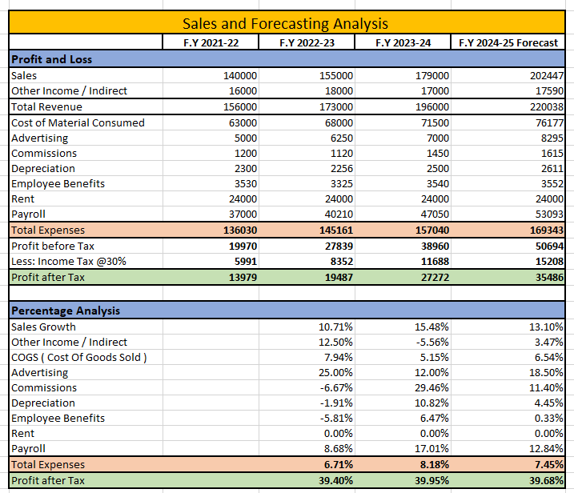

# Financial-Forecasting-and-MIS-Report
---
  

This project provides an in-depth **Sales and Forecasting Analysis** over multiple financial years, offering valuable insights into business performance, cost management, and profitability trends.  

## 🔍 Key Features  
✅ **Profit & Loss Analysis** – Breakdown of revenue, expenses, and net profit  
✅ **Percentage Analysis** – Growth trends and cost structure evaluation  
✅ **Forecasting for F.Y 2024-25** – Data-driven predictions  
✅ **Data Visualization** – Graphical representation for better understanding  

## 📈 Insights  
📌 **Sales Growth** – Increasing sales and revenue over the years  
📌 **Expense Breakdown** – Major cost contributors analyzed  
📌 **Profitability Trends** – Rising profit margins and financial health  
📌 **Future Forecasting** – Predicting next year's financial performance  

## 🛠️ Tools Used  
- **Microsoft Excel** – Data analysis & reporting, Data visualization & dashboards  

## 📊 Visuals  
### Profit & Loss Analysis  
  

### Percentage Analysis  
  

## 🏆 Conclusion  
This project helps businesses make **informed financial decisions** by understanding revenue trends, expense patterns, and profitability forecasts.  

📢 **Contributions & Feedback are Welcome!**  

---
**📩 Connect with me:**  
🔗 [LinkedIn](https://www.linkedin.com/in/vijay-sanas-2056b3253/)  
📧 vijay.sanas45@gmail.com 

